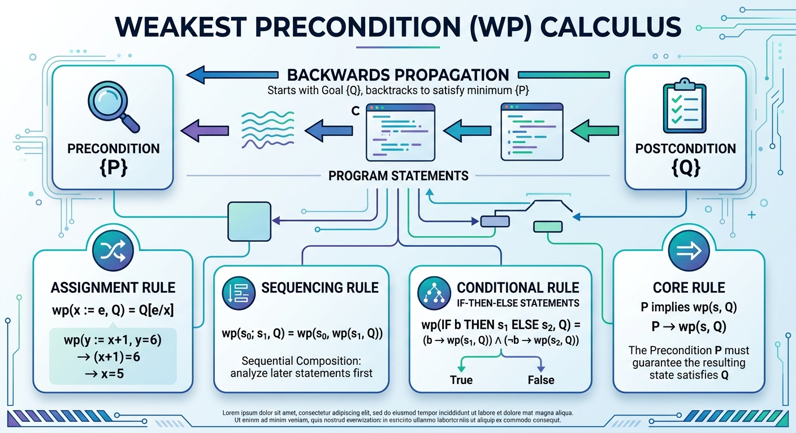
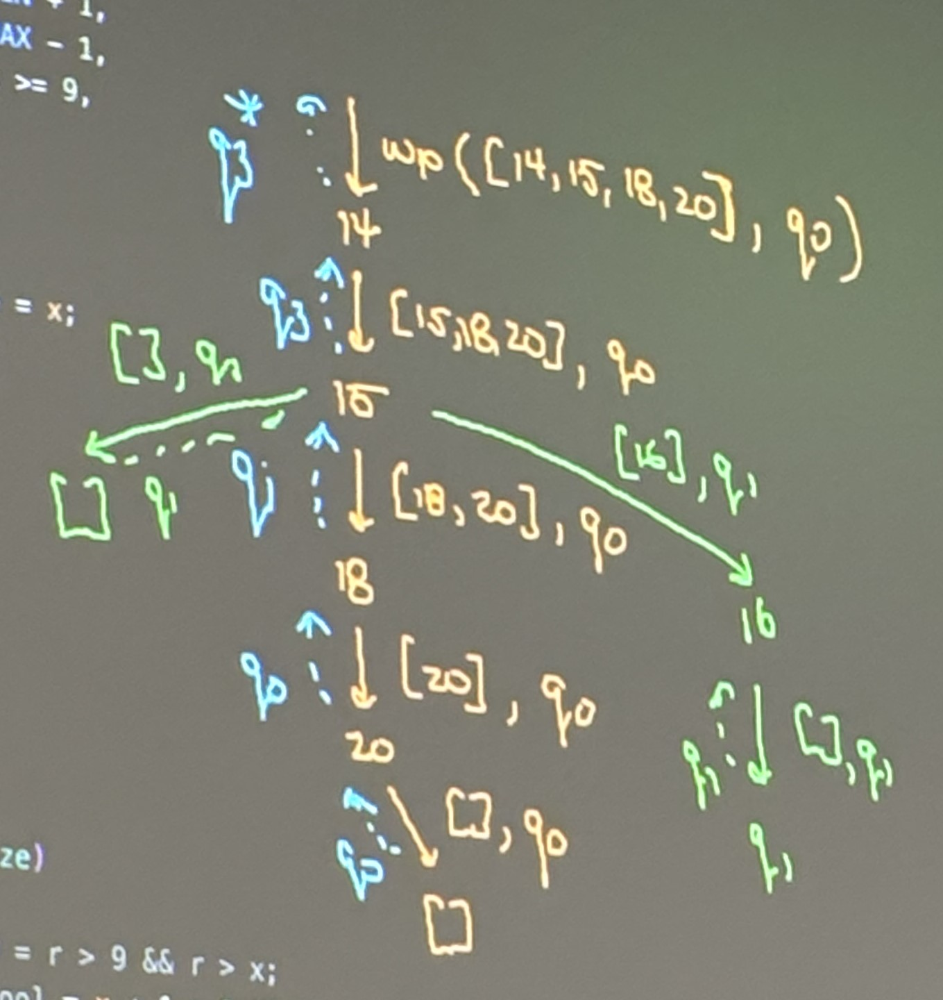

# Weakest Precondition 

*How verus works*

## Hoare Logic

* Hoare triples
  * `{P} s {Q}`
    * `{P}` = precondition
    * `{Q}` = postcondition
    * `s` = statement -> assumes termination 
  * strongest postcondition calculus $\rightarrow$
    * look a precondition to satisfy postcondition 
    * $sp(s,P) \rightarrow Q$
  * weakest precondition calculus $\leftarrow$
    * figure out what weakest precondition needs to be to imply weakest postcondition 
    * $p \rightarrow wp(s,Q)$
    * use to propagate through all the statements ending at precondition (`{P}`)
    * rules:
      * termination case: $wp([], Q) = Q$
      * sequencing rule: $wp([s_0; s_1,], Q) = wp([s_0], wp([s_1], w)$
      * $wp([x: = e], Q) = Q[e/x]$
      * conditional (if) rule: $wp([if \ c \ s_r \ s_E], Q) = (c ^ wp([s_T], Q)) V (\not c ^ wp(s_E],Q)$
      * $wp([assume \ e],Q) = e \rightarrow Q$
      * $wp([assume \ e],Q) = e ^ Q$
      * $wp([y = f(x)],Q) = wp([assort \ f_{pre}[x/i] assume f_{post}[x,y/i,o], Q)$


### Weakest Precondition Calculus Rules



### Code Example
```rust
exec fn g(x: isize) -> (r: isize) 
        requires
            x > isize::MIN + 1,
            x < isize::MAX - 1,
            x <= -9 || x >= 9,
        ensures
            r > 9,
            r > x,
    {
        let mut r: isize = x;
        if r < 0 {
            r = -r;
        }
        r = r + 1;

        r
    }
```

Numbers are correlated to lines of code in the above.

